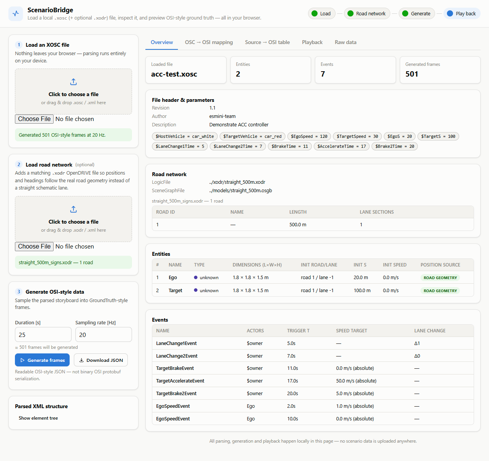
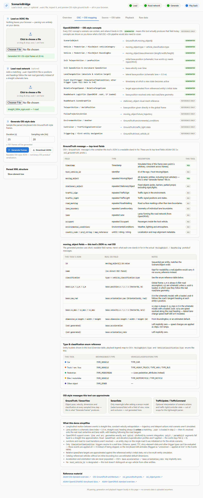
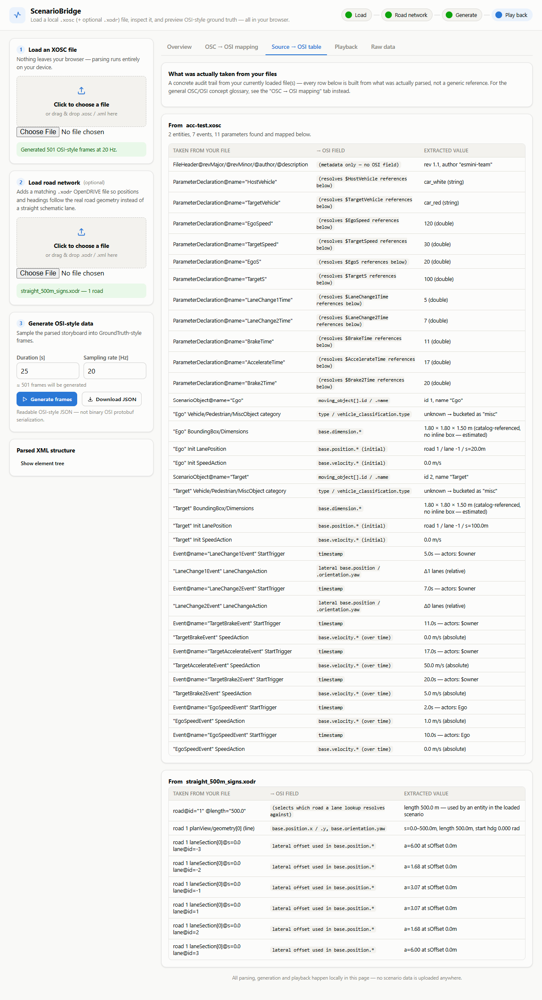
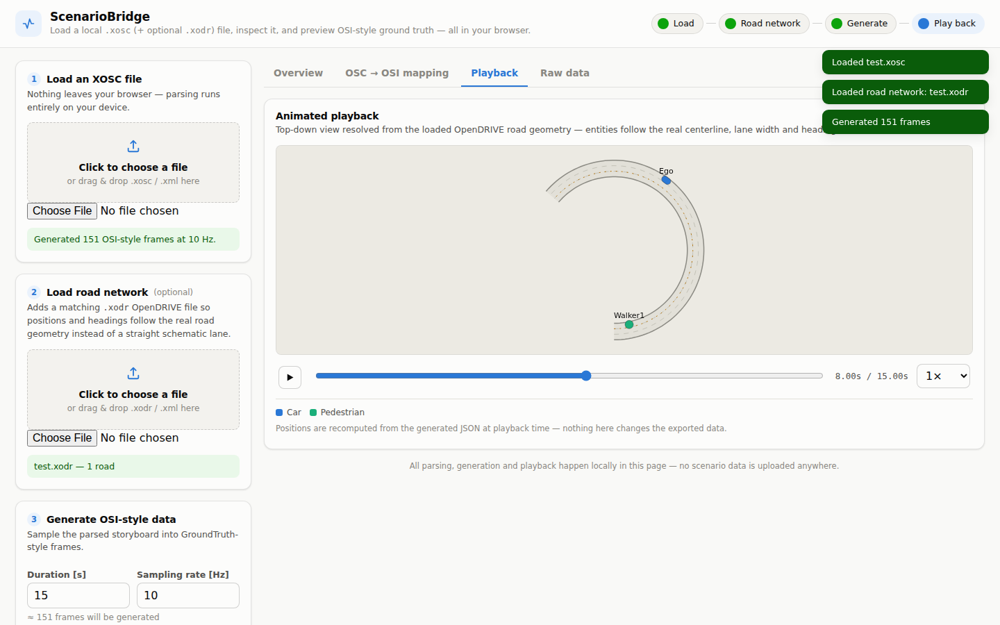
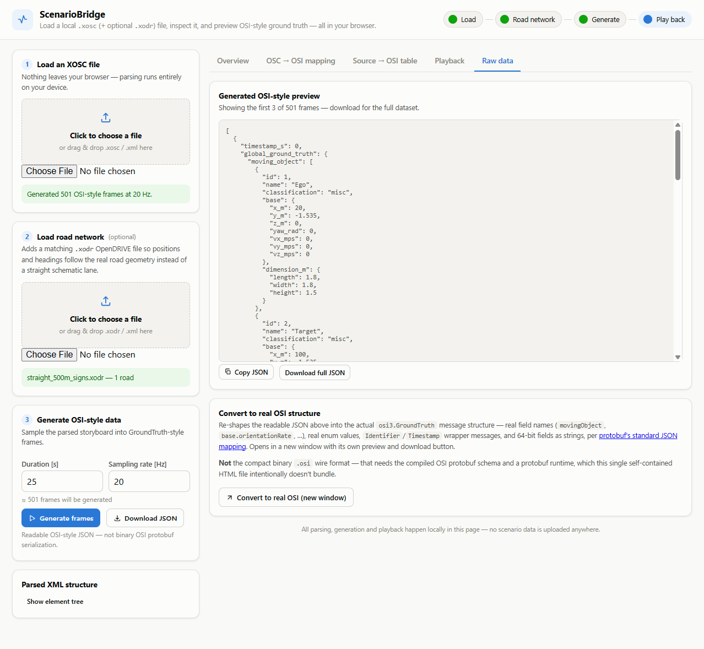
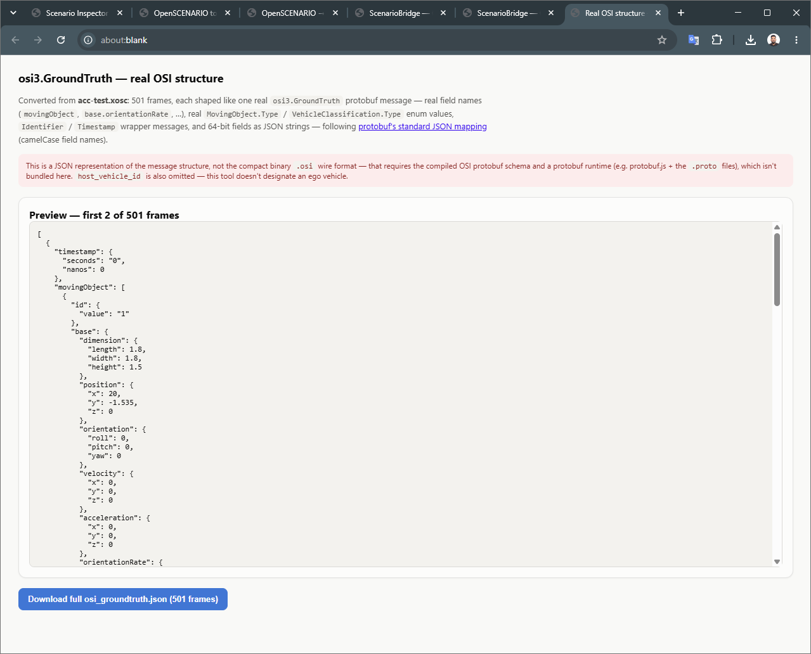

# ScenarioBridge

[](LICENSE)
[](https://github.com/VPA2998/scenario-bridge/actions/workflows/ci.yml)
[](https://github.com/VPA2998)

**OpenSCENARIO + OpenDRIVE → OSI-style ground truth, entirely in your browser.**

ScenarioBridge is a single self-contained HTML file that loads a local
`.xosc` (ASAM OpenSCENARIO) file — and optionally a matching `.xodr`
(ASAM OpenDRIVE) road network — parses it client-side, and generates
readable, OSI-style ground-truth frames you can inspect, play back, and
export. Nothing is uploaded anywhere; everything runs locally in the page.


## Quick start

No install, no build step:

1. Download [`ScenarioBridge.html`](ScenarioBridge.html) (or clone this repo).
2. Open it in any modern browser.
3. Load a `.xosc` file, optionally load a matching `.xodr`, set a duration
   and sampling rate, and click **Generate frames**.

Or [try the live demo](https://vpa2998.github.io/scenario-bridge/) — no
download needed.

## What it does

- **Parses `.xosc`**: file header, parameters (including arithmetic
  expressions like `$Speed / 3.6`), road network references, entities
  (vehicles, pedestrians, misc objects), their initial state, and every
  storyboard event (speed changes, lane changes, trigger times).
- **Optionally parses `.xodr`**: when a matching road network is loaded,
  entity positions and heading are resolved onto the real road — line, arc,
  and spiral geometry segments, and lane width polynomials — instead of a
  straight schematic lane.
- **Generates OSI-style frames**: samples the parsed storyboard at a
  configurable duration and rate into readable JSON shaped like OSI's
  `GroundTruth.moving_object[]`.
- **Plays it back**: an animated top-down view with play/pause, scrub, and
  speed controls — a straight schematic road by default, or the real curved
  road when a `.xodr` is loaded.
- **Shows exactly what came from where**: the "Source → OSI table" tab is a
  file-specific audit trail — every row is built from what was *actually*
  parsed out of your currently loaded files, not a generic reference.
- **Converts to the real OSI structure**: reshapes the tool's readable JSON
  into an actual `osi3.GroundTruth`-shaped payload — real field names,
  real enum values, `Identifier`/`Timestamp` wrapper messages, 64-bit fields
  as strings, per protobuf's standard JSON mapping — opened in a new window
  with its own preview and download button.

## What it deliberately doesn't do

This is a lightweight inspection/demo tool, not a simulator or a full OSI
serializer. In particular:

- Motion between events is straight-line, constant-velocity extrapolation —
  `FollowTrajectoryAction`/mid-scenario `TeleportAction` aren't simulated.
- Only `line`, `arc`, and (numerically-integrated) `spiral` OpenDRIVE
  geometries are supported; `poly3`/`paramPoly3` fall back to a straight-line
  approximation. `laneOffset`, elevation/superelevation, and
  junction/road-link transitions aren't read.
- "Convert to real OSI" produces a JSON representation of the real message
  structure — **not** the compact binary `.osi` protobuf wire format, which
  would require bundling the compiled OSI schema and a protobuf runtime.

The in-app "OSC → OSI mapping" tab has the full, current list of what's
implemented vs. reference-only, including the exact OSI field/enum values
used.

## Screenshots

|  |  |
|---|---|
| **Overview** — file header, parameters, road network, entities, events | **OSC → OSI mapping** — concept and field reference |
|  |  |
| **Source → OSI table** — audit trail from the currently loaded files | **Playback** — animated top-down view resolved onto the road geometry |
|  |  |
| **Raw data** — generated OSI-style JSON preview | **Real OSI structure** — converted to actual `osi3.GroundTruth` shape |
|  |  |

## Running the tests

The test suite drives the app with a real browser (Playwright) against the
sample scenarios in [`test-fixtures/`](test-fixtures), covering parsing,
road-geometry resolution, frame generation, playback animation, the Sources
tab, and the real-OSI converter — and asserts zero console errors throughout.

```bash
npm install
npx playwright install --with-deps chromium
npm test
```

CI (`.github/workflows/ci.yml`) runs the same suite on every push and pull
request against `main`.

Manual testing and the screenshots in this README use sample scenarios from
[esmini](https://github.com/esmini/esmini)'s example resources
(`acc-test.xosc`, `straight_500m_signs.xodr`, and others).

## Live demo

Live at **[vpa2998.github.io/scenario-bridge](https://vpa2998.github.io/scenario-bridge/)**,
served straight from `ScenarioBridge.html` at the repo root via GitHub Pages —
no build step. Forking this repo and enabling Pages (**Settings → Pages** →
deploy from branch `main`, folder `/ (root)`) gets you the same at
`https://<your-username>.github.io/scenario-bridge/`.

## Project layout

```
ScenarioBridge.html          the app — single file, no build step
index.html                   redirects to ScenarioBridge.html (for GitHub Pages)
test-fixtures/                sample .xosc / .xodr files used by the tests
tests/                        Playwright smoke tests
docs/screenshots/              images used in this README
.github/workflows/ci.yml      runs the test suite on push/PR
```

## Contributing

Issues and pull requests are welcome. See [CONTRIBUTING.md](CONTRIBUTING.md).

## Author

Built by [VPA2998](https://github.com/VPA2998).

## License

[MIT](LICENSE)
